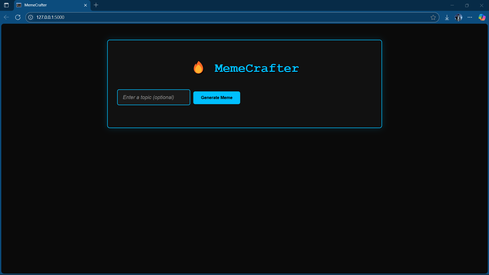

# 🧠 MemeCrafter 🤖  
**Turn everyday chaos into internet gold.**  

MemeCrafter uses AI to generate witty captions and trending meme templates based on your topic — whether it's gym pain, exam panic, or tech fails. Just type, click, and meme!

---

## 🚀 Features

- 🎯 Topic-based meme generation
- 🤖 AI-powered caption generation using **Gemini API**
- 🎨 Automatic meme rendering using **Imgflip API**
- 🎉 Clean and responsive UI with animation effects
- 📱 Mobile-friendly, fast, and fun to use

---

## 🖼️ Demo



---

## 📁 Project Structure

```
meme-crafter/
├── app.py                   # Flask backend
├── meme_generator.py        # Integrates Imgflip API
├── reddit.py                # (Optional) Template fetch from Reddit
├── gemini_gen.py            # Gemini API integration for captions
├── caption_generator.py     # Caption controller logic
├── .env                     # API keys and secrets
├── requirements.txt         # Python dependencies
├── templates/
│   └── index.html           # Main HTML page
└── static/
    ├── style.css            # UI styling
    └── script.js            # Frontend animations & interactivity
```

---

## ⚙️ Setup Instructions

1. **Clone this repo**
   ```bash
   git clone https://github.com/yourusername/meme-crafter.git
   cd meme-crafter
   ```

2. **Create a virtual environment**
   ```bash
   python -m venv venv
   source venv/bin/activate  # On Windows: venv\Scripts\activate
   ```

3. **Install dependencies**
   ```bash
   pip install -r requirements.txt
   ```

4. **Create a `.env` file** and add:
   ```
   IMGFLIP_USERNAME=your_imgflip_username
   IMGFLIP_PASSWORD=your_imgflip_password
   GEMINI_API_KEY=your_gemini_api_key
   ```

5. **Run the app**
   ```bash
   python app.py
   ```

6. **Visit**
   ```
   http://localhost:5000
   ```

---

## ✨ Sample Topics to Try

- "Leg day at the gym"
- "When WiFi goes off during Zoom call"
- "College group project drama"
- "Monday mood"
- "When compiler throws 99 errors but it's one semicolon"

---

## 🛠️ Tech Stack

- **Backend**: Python, Flask
- **Frontend**: HTML5, CSS3, JavaScript
- **APIs**: Gemini (caption generation), Imgflip (meme rendering)
- **Tools**: dotenv, requests, json

---

## 🤝 Contributions

Pull requests are welcome! If you have funny caption logic, new template ideas, or want to improve UX, jump in!

---

## 📜 License

MIT License © Akshayjith P S
